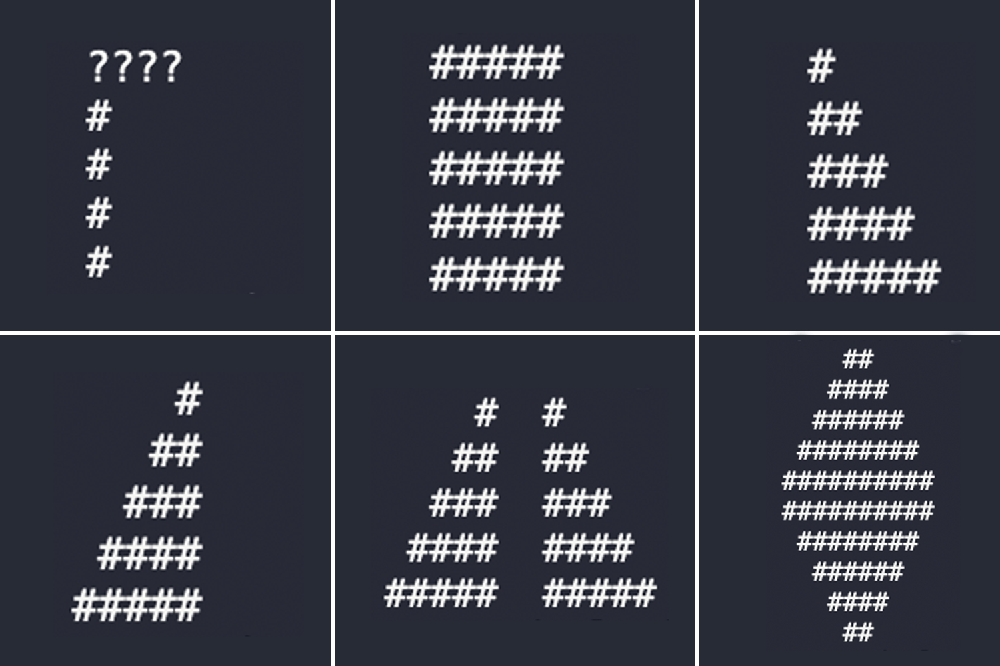

# 🍄 Mario Algoritmos - Estudo de Lógica em C



Este repositório documenta minha jornada de aprofundamento em **Lógica de Programação** e **Algoritmos** utilizando a linguagem C.
O projeto nasceu da necessidade de superar o desafio "Mario" do curso CS50 e evoluiu para a criação de formas geométricas complexas "do zero" (from scratch).

## 🎯 Objetivos
- Dominar loops aninhados (`nested loops`).
- Entender a manipulação de fluxo e condicionais.
- Praticar a criação de algoritmos matemáticos para padrões visuais.
- Refatorar a lógica de construção de pirâmides (Direita vs Esquerda).

## 📂 Estrutura do Projeto

| Arquivo | Descrição |
| :--- | :--- |
| `01_linhas_simples.c` | Aquecimento: Loops lineares horizontais e verticais. |
| `02_quadrado.c` | Introdução a loops aninhados (Matriz 2D). |
| `03_triangulo_esquerdo.c` | Triângulo retângulo **alinhado à esquerda** (Lógica `j < i`). |
| `04_piramide_mario.c` | A famosa pirâmide do **CS50 Mario** (Alinhada à direita). |
| `05_piramide_dupla.c` | Solução do desafio **Mario More** (CS50) com gap central. |
| `06_losango_complexo.c` | **Algoritmo Avançado:** Um diamante completo desenhado com 4 loops e inversão lógica. |

## 🛠️ Como Compilar e Rodar
Este projeto utiliza **C Padrão (Standard C)** e não requer bibliotecas externas (como a `cs50.h`).

Para compilar, você pode usar o `gcc` ou `make` em qualquer terminal:

```bash
# Compilando o desafio final
clang 06_losango_complexo.c -o losango
./losango